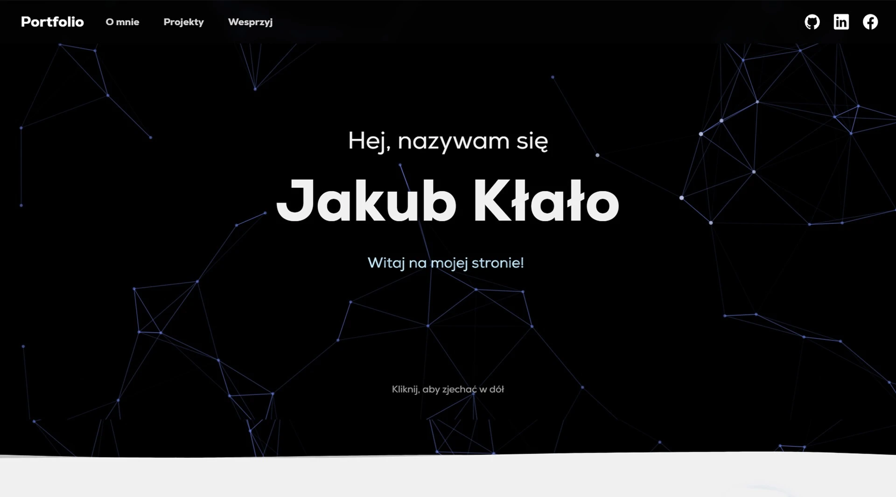

# Portfolio

     

## 📖 Project Description

A personal portfolio website for **Jakub Kłało** — a Fullstack Developer with a passion for programming. The website showcases skills, experience, and completed projects, while also providing a direct contact option through a built-in email form.

### ⚡ Technologies

- **Framework:** [Next.js](https://nextjs.org/docs) with App Router (`/app`)
- **Package Manager:** [pnpm](https://pnpm.io/)
- **Styling:** Sass/SCSS with CSS modules
- **TypeScript:** Full application typing
- **Animations:** react-awesome-reveal, react-wavify, tsparticles
- **Forms:** react-hook-form with Nodemailer integration

### 🚀 Features

- 🏠 Interactive landing page with typewriter effect and animated particles
- 🌊 Animated waves and smooth section transitions
- 👨‍💻 Skills showcase — websites, applications, Discord bots
- 📂 Project portfolio with previews, descriptions, and technologies used
- 📧 Contact form with validation and email sending
- 📱 Responsive design for all devices
- 🎨 Modern UI with animations and visual effects
- 🔗 GitHub integration — links to project repositories

###

## ☕ Project Support

If this project has been helpful to you, you can buy me a coffee as a thank you for the work invested.

Thank you for all your support! 🙏
